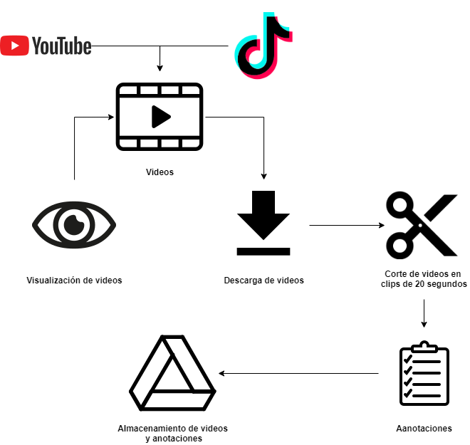
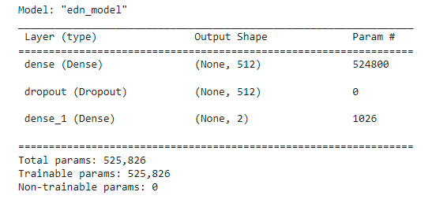
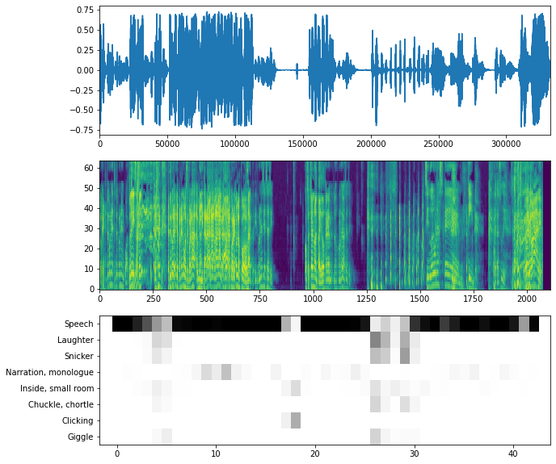
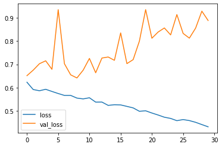
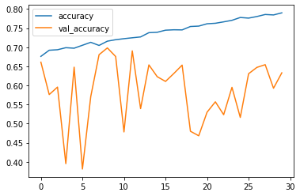
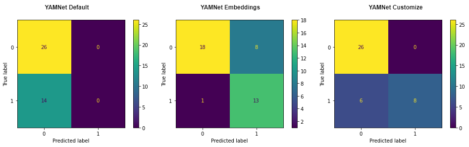

```{r setup, include=FALSE}
knitr::opts_chunk$set(warning = FALSE, 
                      message = FALSE, 
                      comment=FALSE)
```

```{r ,echo=FALSE}
library(tidyverse)
library(lubridate)
```


class: center

```{r xaringan-themer, include=FALSE, warning=FALSE, eval=FALSE}
library(xaringanthemer)
#style_mono_light(base_color = "#23395b")
#style_duo_accent(primary_color = "#FFFFFF", secondary_color = "#FA795E")
style_duo_accent(primary_color = "#FA795E",
                 secondary_color = "#FFFFFF",
                 header_h1_font_size = "1.8rem",
                 header_h2_font_size = "1.5rem",
                 header_h3_font_size = "1.0rem"
                 )
#style_duo_accent_inverse(primary_color = "#FFFFFF", secondary_color = "#FA795E")
#style_duo_accent_inverse(primary_color = "#FA795E", secondary_color = "#FFFFFF")
```


```{r, echo=FALSE}

```

<br>
<br>
<br>
<br>

 <font size="10"> Gestión y Análisis de Datos no Estructurados</font> 

<br>
<br>

#### 2021-11-25

#### Rafael Zambrano
---
class: center

```{r, echo=FALSE}

```

<br>
<br>
<br>

## Trabajo Práctico Final: Procesamiento de Audio

<br>

#### Rafael Zambrano

---

background-image: url(https://blogs.rstudio.com/ai/posts/2021-02-04-simple-audio-classification-with-torch/images/preview.jpg)

---

# Caso de uso

## Objetivo

Análisis de audio de un podcast de comedia, con el objetivo de determinar para un conjunto de videoclips si existió alguna risa o carcajada.

```{r, echo=FALSE,  fig.show = "hold", out.width = "50%"}
library(cowplot)
library(ggpubr)
library(ggplot2)

fig1_path <- c("https://www.trecebits.com/wp-content/uploads/2020/05/Crear-un-podcasts.jpg")
fig2_path <- c("https://yt3.ggpht.com/ytc/AKedOLQ8HsIjr8epEVBmHHdAISJC2iAORc1WpVQYQ6MB=s900-c-k-c0x00ffffff-no-rj")

scaling <- 0.45
ggdraw() + draw_image(fig1_path)
ggdraw() + draw_image(fig2_path, scale = scaling)
```


---

# Extracción de información

## 🔶 Flujo de captura de datos

```{r, echo=FALSE, out.height= "60%", out.width= "60%", fig.align='center'}

```

### Son generados 200 videoclips de 20 segundos cada uno.
---

# Modelado

## 🔸YAMNet default:
Se toman las categorías por defecto seleccionando la categoría top generada por el modelo


## 🔸YAMNet customize:
Se toman las categorías por defecto seleccionando las 3 principales categorías generada por el modelo, verificando la presencia de alguna categoría relacionada con la risa.


## 🔸YAMNet Embeddings

---

# YAMNet Embeddings

## 🔸 Arquitectura 

```{r, echo=FALSE, out.height= "70%", out.width= "70%", fig.align='center'}

```

---

# Predicciones para un audio

```{r, echo=FALSE, out.height= "60%", out.width= "60%", fig.align='center'}

```

🔸 YAMNet default: Predice para todos los audios "Spech" como categoria principal.

🔸 YAMNet customize: Predice las 3 principales categorías, muestra True si alguna categoría de referente a la "risa" se encuentra dentro de estas 3.


---

# Evaluación de YAMNet Embeddings 

## 🔸 Loss evaluación

```{r, echo=FALSE, out.height= "40%", out.width= "40%", fig.align='center'}

```


## 🔸 Accuracy evaluación

```{r, echo=FALSE, out.height= "40%", out.width= "40%", fig.align='center'}

```

---

# Comparación de modelos sobre el conjunto de validación


```{r, echo=FALSE, out.height= "100%", out.width= "100%", fig.align='center'}

```

